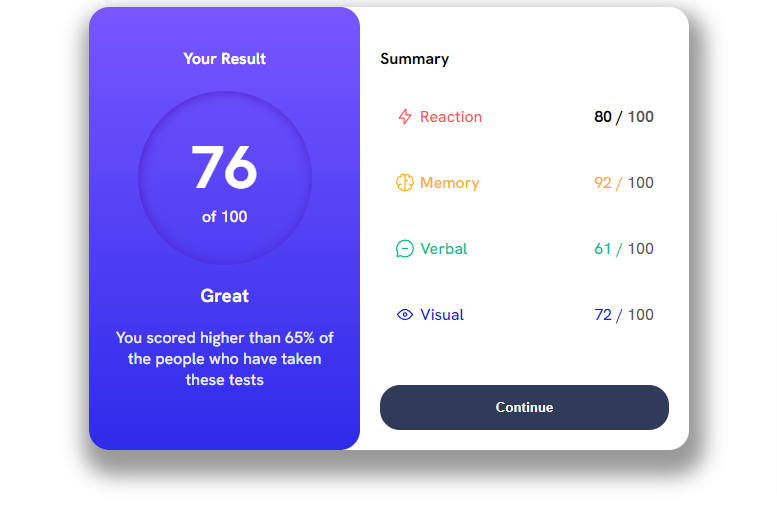
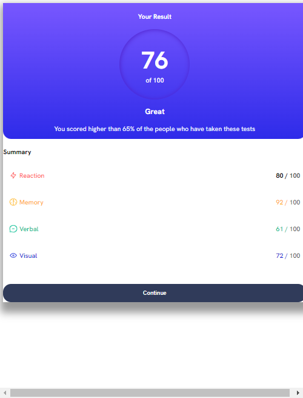

# Frontend Mentor - Solução de componente de resumo de resultados

Esta é uma solução para o [Results summary component challenge on Frontend Mentor](https://www.frontendmentor.io/challenges/results-summary-component-CE_K6s0maV). Os desafios do Frontend Mentor ajudam-no a melhorar as suas capacidades de codificação através da construção de projectos realistas. 

## Tabela de conteúdos

  - [O Desafio](# o desafio)
  - [Captura de ecrã](#screenshot)
  - [Links](#links)
- [O meu processo](#my-process)
  - [Construído com](#built-with)
  - [O que aprendi](#what-i-learned)
  - [desenvolvimento continuado](#continuação do desenvolvimento)
  - [Recursos úteis](#recursos úteis)
- [Autor](#autor)
- [Agradecimentos](#acknowledgments)

**Note: Apague esta nota e actualize o índice com base nas secções que guarda.**

### O desafio

Os utilizadores devem ser capazes de o fazer:

- Ver a disposição óptima da interface, dependendo do tamanho do ecrã do seu dispositivo
- Ver os estados de pairar e focar para todos os elementos interactivos na página

### Imagem de ecrã



### Mobile



### Ligações

- URL da solução: [Adicione aqui o URL da solução](https://your-solution-url.com)
- URL do sítio em directo: [Adicione aqui o URL do sítio em directo](https://your-live-site-url.com)

## O meu processo

Basicamente eu demorei algumas horas pra finalizar esse projeto. Eu comecei dando as classes pra todos elementos html, refatorando tudo pra inglês, pois é uma forma de eu começar a praticar o inglês nos códigos.

Antes de finalizar busquei refatorar todo código css pra diminuir as linhas.

#### Construído com

- Marcação HTML5 semântico
- Propriedades personalizadas do CSS
- Flexbox
- Fluxo de trabalho Dekstop-primeiro
- [HTML](https://www.w3schools.com/html/) - Biblioteca do HTML
- [CSS](https://www.w3schools.com/css/) - Biblioteca do CSS

### O que aprendi

Apenas botei em prática tudo que aprendi. Eu fiquei muito em dúvida no sumário, como eu chamaria os socres visual, memory, reaction, verbal. Após algum estudo resolvi chamar eles pela classe `span`

```html
 <div class="right">
      <h4>Summary</h4>
      <div class="score">
        <div class="score-reaction">
          <div class="score-con">
            
            <span>Reaction</span>
          </div>
          <span id="black-text">80 / <span class="grey">100</span></span>
        </div>
        <div class="score-memory">
          <div class="score-con">
            
            <span>Memory</span>
          </div>
          <span class="black-text">92 / <span class="grey">100</span></span>
        </div>
        <div class="score-verbal">
          <div class="score-con">
            
            <span>Verbal</span>
          </div>
          <span class="black-text">61 / <span class="grey">100</span></span>
        </div>
        <div class="score-visual">
          <div class="score-con">
            
            <span>Visual</span>
          </div>
          <span class="black-text">72 / <span class="grey">100</span></span>
        </div>
        
      </div>
```
```css
    padding: 50px;
    width: 74px;
    height: 74px;
    border-radius: 100%;
    box-shadow: inset 1px 1px 12px 0px var(--violeta-azul-circulo);
    display: flex;
    align-items: center;
    justify-content: center;
    flex-direction: column;
    margin: 0 auto;
```
### Continuação do desenvolvimento

Primeiramente refatorar o CSS. Atualmente está com 171 linhas. Quero reduzir bem ele, e as variáveis estão em português.

## Autor

- Linkedin - [Gustavo Araujo](https://www.linkedin.com/in/ga20222/)
- Frontend Mentor - [@onedreamcwb](https://www.frontendmentor.io/profile/onedreamcwb)

## Agradecimentos

Agradecimentos ao Allan que me ajudou a ver um erro em meu código onde eu estava fazendo uma chamada global no body com `view-height`e não `view-width` e a disponibilizar seu tempo pra sempre tentar ajudar.
